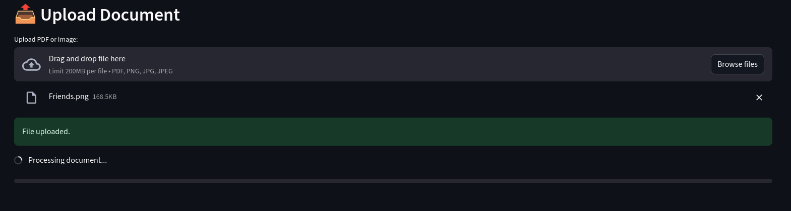
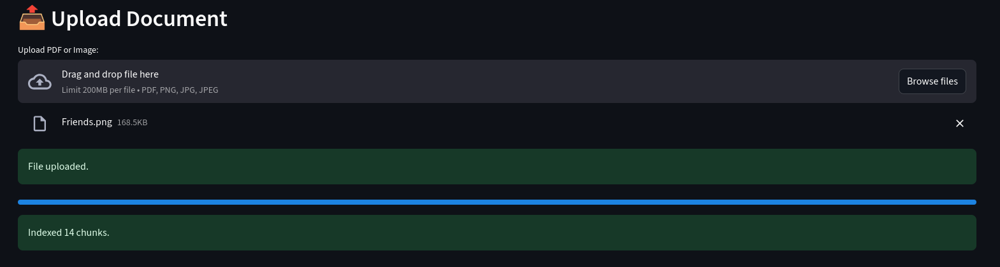
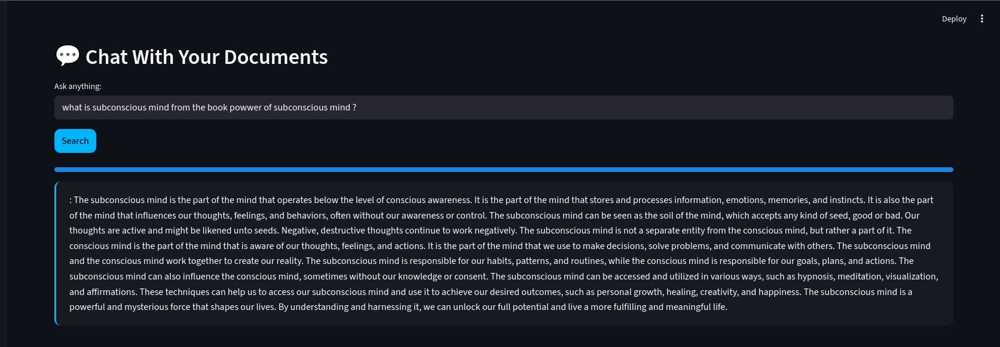
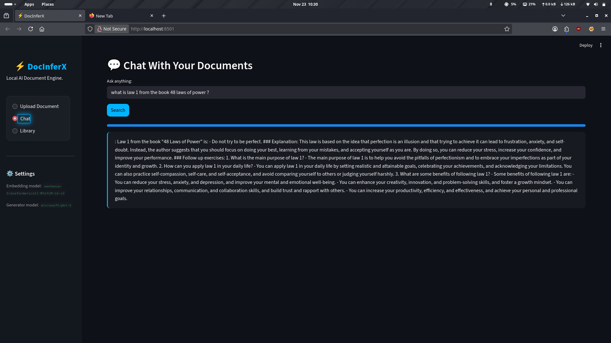

# ⚡ DocInferX  
Local AI Document Intelligence Engine

## 📘 Overview

DocInferX is an offline-ready RAG (Retrieval Augmented Generation) system that lets you upload PDFs or images, extracts the text automatically (OCR + PDF parsing), indexes it using FAISS vector search, and allows you to chat with your documents using a local LLM (Phi-2).  
The project is built for privacy-focused document intelligence: fast, local, and completely offline.

---

## ⭐ Features

-  **Upload PDF or Images** (PNG/JPG/JPEG)
-  **Automatic OCR** using PaddleOCR
-  **Smart text chunking & cleaning**
-  **FAISS Vector Search** for fast recall
-  **Local LLM (Phi-2)** for answering queries
-  **Matrix rain cyber UI**
-  **Streamlit Frontend**
-  **Docker support** for easy setup
-  **Runs fully offline**
-  **Document Library view**

---

## 🛠 Technologies & Tools Used

- **Python 3**
- **Streamlit** — UI framework
- **FAISS** — vector database
- **Sentence Transformers** — embeddings
- **Phi-2 / HuggingFace Transformers** — LLM
- **PaddleOCR** — OCR engine
- **PyPDF2 / pdfreader** — PDF parsing
- **Docker** — for containerized deployment

---

## 🔧 Installation & Run Guide

### 1. Clone the repository
```bash
git clone https://github.com/shekh-2810/DocInferX.git
cd DocInferX
```

### 2. Create a virtual environment
```bash
python3 -m venv venv
source venv/bin/activate      # Linux/macOS
venv\Scripts\activate         # Windows
```

### 3. Install dependencies
```bash
pip install -r requirements.txt
```

### 4. Run the app
```bash
streamlit run streamlit_app.py
```
### 5. Open on web browser
```bash
http://localhost:8501
```

## 🐳 Docker Setup

### 1.Build the image:
```bash
docker build -t docinferx .
```
### 2.Run the container:
```bash
docker run -p 8501:8501 docinferx
```

## 🧪 Testing Instructions:

**1.Open the application in your browser.**

**2.Upload any PDF or image.**

**3.Wait for OCR + indexing to complete.**

**4.Open the Chat tab.**

**5.Ask questions related to the uploaded document.**

**6.Compare answers with the source document to verify accuracy.**

## Screenshots


### Upload Page


### Completion of upload


### Sidebar


### Results






### Library


## 👤 Maintainer

# **Developed by Shashank Shekhar Choudhary.**

## ⭐ Support

**If you find this project useful, consider starring the repo!**

👉 https://github.com/shekh-2810/DocInferX
